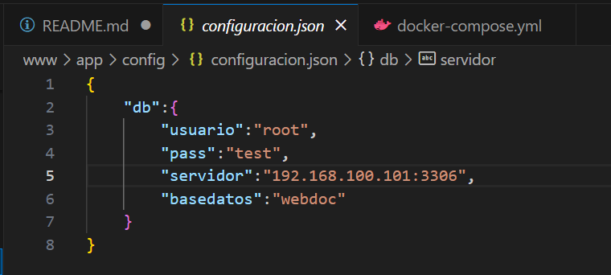
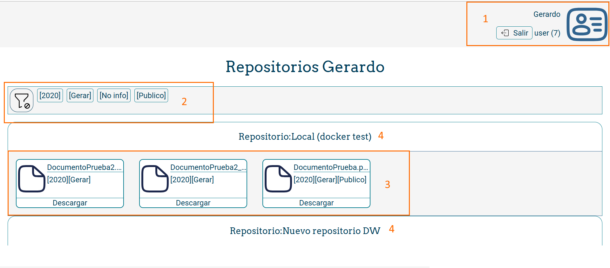

# Plataforma distribución documentos

Este repositorio incluye una plataforma para distribución *ágil* de de documentación desde repositorios privados a un *elevado número de consumidores*.

## Descripción

Existe una problemática habitual en el mundo empresarial que consiste en dar acceso a un elevado número de consumidores a su documentación desde repositorios privados.
Por ejemplo: las nóminas de trabajadores deberían estar accesibles en un repositorio para todos los empleados pero muchas veces se encuentran en repositorios privados en el departamento de recursos humanos. Lo mismo aplica a facturas, pedidos, etc.

Se pretende proporcionar un sistema *sencillo* y *seguro* que permita acceder a la documentación seleccionada por administradores a un elevado número de consumidores.

## Instalación / Puesta en marcha

Para puesta en marcha de la aplicación de forma dockerizada es posible clonar el entorno mediante comando (necesario disponer acceso al repositorio):

`git clone https://gitlab.iessanclemente.net/dawd/a22gerardopc.git`

Se creará un directorio (a22gerardopc). Dentro del mismo podemos levantar los servicios dockerizados mediante el comando:

`docker compose up`

La aplicación configura el acceso a la base de datos mediante el fichero situado en [/www/app/config/configuracion.json](./www/app/config/configuracion.json)  

**Es necesario cambiar los datos de acceso (IP de la base de datos y credenciales en producción) y mantener seguro su acceso.**

Una vez levantados los contenedores y configurado el fichero config.json, es posible acceder a la aplicación desde cualquier navegador en la dirección local:

`http://localhost`

El primer usuario creado será el administrador de la aplicación, a partir de ahí se pueden crear todos los demás.

Nota: De los servicios incluidos en el fichero docker-compose sólo 2 son necesarios para la ejecución de la aplicación:
1. www: Es el servidor web con la aplicación
2. db: La base de datos de la aplicación

Existen a mayores 2 servicios opcionales empleados para desarrollo y depuración (phpmyadmin y samba).

## Uso

La solución pretende ser muy accesible para el usuario. Únicamente es necesario identificarse en la pantalla de Login (el usuario nos lo facilitará el administrador) y acceder al repositorio y ficheros que queramos descargar.

La interfaz principal tiene las siguientes partes:
1. Información del usuario registrado y sesión.
2. Filtros posibles.
3. Documentos del repositorio seleccionado.
4. Distintos repositorios que tiene acceso.

El uso como administrador y diseño ampliado de la solución puede consultarse [aquí](./doc/5.-Guia_uso.md).

## Sobre el autor

Gerardo Portugués Concepción es especialista en gestión documental en grupo Solitium con mas de 10 años de experiencia. Aficcionado a fotografía, juegos de mesa y tecnología.
Desarrollo este proyecto como respuesta a las continuas solicitudes de clientes que necesitan dotar de acceso a documentación a un elevado número de usuarios (empleados, clientes, proveedores...) de modo sencillo.

Contacto:
+ [e-mail: pcgerard@gmail.com](mailto:pcgerard@gmail.com)
+ [Linkedin](https://www.linkedin.com/in/gerardoportugues/)

## Licencia

WebDoc © 2024 by Gerardo Portugués Concepción is licensed under CC BY-NC-SA 4.0 

### Licencia recursos adicionales

**Fuente Arvo:** Copyright (c) 2010-2013, Anton Koovit (anton@korkork.com), with Reserved Font Name 'Arvo'
This Font Software is licensed under the [SIL Open Font License, Version 1.1](https://openfontlicense.org/open-font-license-official-text/).

**Fuente Roboto**, Designed by Christian Robertson bajo cliencia [Apache License - Version 2.0, January 2004](https://www.apache.org/licenses/LICENSE-2.0)

**Iconos Solar Line - SVGRepo** se licencian de modo libre. Info en: [SVGRepo - Solar Line](https://www.svgrepo.com/collection/solar-line-duotone-icons/).

**Iconos Tabler Icons** se licencian de modo libre. Info en: [TablerIcons.com](https://tablericons.com/) 

## Índice

1. Anteproyecto
    * 1.1. [Idea](doc/1.-Idea.md)
    * 1.2. [Necesidades](doc/2.-Necesidades.md)   
2. [Análisis](doc/3.-Análisis.md)
3. [Planificación](doc/4.-Planificacion.md)
4. [Guía uso administradores](doc/5.-Guia_uso.md)

## Guía de contribución

Para contribuir con este proyecto puede ponerse en contacto con Gerardo Portugués Concepción en  [pcgerard@gmail.com](mailto:pcgerard@gmail.com)

Se mantiene un listado de funcionalidades pendientes aquí: [Contribución](doc/6.-Todo.md)

## Links

Línks útiles y recursos empleados:

+ [Proyecto alojado segundapantalla.es](https://segundapantalla.es/)
+ [Docuware API](https://developer.docuware.com/)
+ [Google fonts](https://fonts.google.com/)
+ [Iconos tablericons.com](https://tablericons.com)
+ [Iconos svgrepo.com ](https://www.svgrepo.com/collection/solar-line-duotone-icons/)
+ [PHP.net](https://www.php.net/)
+ [Recursos desarrolladores Mozilla](https://developer.mozilla.org/es/)