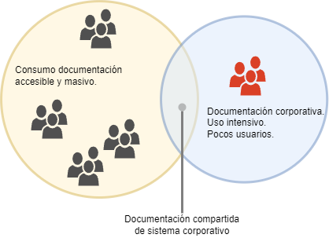

# Idea

El proyecto será un **entregable** de una aplicación que permita acceder de forma sencilla a documentación de un repositorio privado empresarial (preferiblemente un gestor documental -DMS-, pero que pueda ser "intercambiable" por sistemas tradicionales de almacenamiento en carpetas.)

Pretendo evitar las complicaciones que surgen en las empresas habitualmente al resolver el acceso a un "amplio" número de usuarios a documentación que está centralizada en sistemas de gestión documental o archivadores locales de cliente (por ejemplo nóminas, facturas, contratos, etc.) y romper una barrera tradicional de los entre [DMS](https://es.wikipedia.org/wiki/Software_de_gesti%C3%B3n_documental) orientados a uso interno.

La aplicación estará dirigida inicialmente a empresas (entre 20-500 empleados)donde la distribución masiva de documentación consume recursos o no se realiza realizarse (ej: Nóminas distribuidas en papel o por mail -incluso a empleados que no saben usarlo-, comunicaciones generales, proveedores que quieren consutar estado de sus facturas o descargar sus albaranes de entrega, formación, etc.

Actualmente muchos gestores documentales no permiten el acceso externo de modo sencillo a la documentación. Muchos proponen licenciamientos para colaboradores o para todos los usuarios y esto no es económicamente viable muchas veces. Tampoco es práctico el envío de una copia del documento a un número elevado de consumidores de forma manual.

Las grandes empresas resuelven este problema con intranets / extranets / portal de proveedores, empleados, etc. pero existe un hueco entre empresas muy grandes y pequeñas que no disponen de una solución sencilla para esto. Es posible que el proyecto sea comercializable en este entorno y, de echo, es posible aprovechar la base de clientes implantada en algunos distribuidores de ECM (Docuware, Sharepoint, etc.) para promocionarlo como complemento.

Muchos fabricantes, por motivos comerciales, tratan de licenciar también a los consumidores externos o dificultan el acceso a estos a documentación compartida (Ej. [Ej. Docuware-sharing-documents](https://start.docuware.com/blog/product-news/for-best-internal-collaboration-sharing-documents-as-a-link#:~:text=If%20you%20want%20to%20share,is%20often%20the%20better%20option.) )

Existen empresas que desarrollan soluciones similares para extender las funcionalidades de software general y adaptarlo a legislaciones locales ([Ej. Ricoh-ley-crea-y-crece](https://www.youtube.com/live/kWYonY7vGuE)) o crean portales con tecnologías genéricas ([Ej. Intranet con Worpress](https://www.webempresa.com/blog/como-crear-una-intranet-wordpress.html))

El objetivo es hacer una aplicación sencilla de usar y mantener, que cubra un hueco existente en mercado y que ponga en práctica lo aprendido en el ciclo, incluyendo:    
* Conexión a sistemas de almacenamiento externos, inicialmente:
    * Docuware, mediante API pública.
    * Estructura de carpetas local.
* Frontend de usuarios sencillo,agradable y accesible desde dispositivos móviles.
* Seguridad en acceso a su documentación privada.

Como ejercicio pŕactico para asentar conocimientos adquiridos, y simplificar lo máximo la aplicación, se pretende realizar todo el proyecto con tecnología estándar y sin frameworks.

En resumen, el proyecto pretende dar accesibilidad a un numero elevado de usuarios para un consumo sencillo de documentación manejada por terceros.
