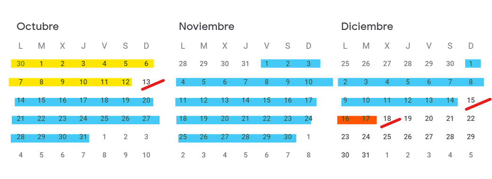

# ESTUDO DE NECESIDADES E MODELO DE NEGOCIO

## Xustificación das necesidades detectadas que cubre o sistema a desenvolver
Muchas empresas necesitan distribuir de modo sencillo documentación a un número elevado de consumidores (empleados, clientes, socios, etc.)

   
Algunas empresas aún mantienen la documentación en estructuras locales o no pueden licenciar, personalizar, mantener, etc. un CMS para un amplio número de consumidores.

El proyecto pretende resolver la distribución sencilla de documentación a un alto número de "consumidores".

El proyecto pretende responder a estas necesidades mediante una aplicación web de mantenimiento sencillo y que pueda conectarse a los sistemas actuales de la organización.
    
Esto se hará creando una herramienta facil y accesible para las organizaciones, que resuelva el problema indicado.
    
El proyecto pretende ser un ejercicio que cree un modo de resolver la problemática indicada.
    
Se empleará un entorno habitual de desarrollo con tecnologías tradicionales ( LAMP / WAMP + VS Code + Docker + Git) complementado en pruebas con algún repositorio corporativo ( Docuware ).
    
Con estas herramientas se afronta la creación de una aplicación que permita configurar y publicar documentso desde CMS corporativos.
    
    
Por dimensión de proyecto se empleará una metodología de Cascada con realimentación. 
    
## Recursos y plazos

Al tratarse de una prueba de concepto acotada en el tiempo con 1 persona será suficiente para la aplicación "piloto". Para una eventual comercialización sería necesario además de desarrolladores, personal de soporte y administrativos, así como comerciales. 

El proyecto se realizará dentro de los plazos asignados para el proyecto.

Los hitos principales son: 
- 13/Octubre: Anteproyecto validadado.
- 15/Diciembre: Entrega.
- 18/Diciembre: Defensa.

El objetivo deseable será:

| Nº| Semana | Objetivo                      |
|---|--------|-------------------------------|
| 1  | 30/Sep | Validación idea y anteproyecto|
| 2  | 7/Oct  | Diseño |
| 3  | 14/Oct | Diseño |
| 4  | 21/Oct | Codificación |
| 5  | 28/Oct | Codificación |
| 6  | 4/Nov | Codificación y pruebas |
| 7  | 11/Oct | Codificación y pruebas |
| 8  | 18/Oct | Codificación y pruebas |
| 9  | 25/Oct | Instalador / Corrección errores / mejoras |
| 10  | 02/Dic | Instalador / Corrección errores / mejoras |
| 11  | 09/Dic | Documentación final |
| 12  | 16/Dic | Defensa proyecto |

En el presente proyecto se dedicarán 2 semanas a diseño, 5 a codificación y pruebas dejando otras 2 semanas para mejoras o corrección de errores / imprevistos..

## Posibilidades de comercialización (viabilidade, competidores…).

Durante el proyecto se pretende crear una prueba de uso para demostrar la posible viabilidad  técnica de la idea. No se dispone de financiación para comercialización, soporte posterior a posibles clientes, etc. Para el siguiente paso sería necesaria inversión externa.

Inicialmente, al tratarse de documentación personal para distribuir a través de internet, parece que un reto será la seguridad. Otro reto inicial es hacer sencilla la administración de usuarios/documentos disponibles.
    
El objetivo principal del proyecto no es ser viable económicamente pero podría hacerse:
*  De modo independiente: Para que el proyecto sea viable económicamente, al menos tendría que tener 2 personas de desarrollo y soporte (bajas, vacaciones, etc.). Si se incluyen gastos adicionales como oficinas, equipamiento, asesoría, etc. pomdríamos hablar de una inversión en torno a 80.000 - 100.000 €/año. Parece un riesgo elevado.
*  Como alternativa podría venderse el producto a una organización que ya mantenga sistemas similares. De este modo no necesitaríamos inversión inicial y la organización compradora podría mantenerlo con la infraestructura que ya disponga.
    
No se investigó si existe financiación externa, sobre todo para la primera opción de viabilidad indicada.

Existen sistemas similares para publicar documentación o información genéricos (CMS) como [Wordpress](https://wordpress.com/es/), [Joomla](https://www.joomla.org/), [Drupal](https://www.drupal.org/)... algunos mas específicos para documentación [Alfresco](https://www.hyland.com/es/solutions/products/alfresco-platform)... pero no parece existir un producto de nicho sencillo como el propuesto.
    
Los sistemas mencionados anteriormente serían las principales alternativas a la solución propuesta.

## Ideas para a súa comercialización.

El objetivo inicial no es la comercialización del proyecto, pero al conocer mercado y tener acceso a distintas compañías donde podría encajar, sería posible proponérselo. La técnica elegida inicialmente sería un contacto directo, personal, con los responsables de las empresas objetivo para poder aprovechar también un feedback directo.

Al tratarse de un proyecto educativo, no se disponen de medios para hacer una campaña competitiva en redes, web, eventos, etc. Por la situación del desarrollador la mejor opción parece un contacto directo cliente a cliente.

En caso de comercialización, el modelo de pago adecuado parece ser una suscripción en función del número de usuarios/documentos que acceden a la documentación mas un importe por los servicios de despliegue, formación, mantenimiento y, llegado el caso, personalización.

Se elige este modelo porque  es el habitual en software empresarial por suscripción. Las principales dimensiones para tarificarlo son:
- El número de usuarios
- El número de repositorios de acceso
- El número de documentos gestionado

Además, al necesitar un alojamiento, posible mantenimiento, etc... el modelo de suscripción parece el más adecuado.

# Webgrafía
