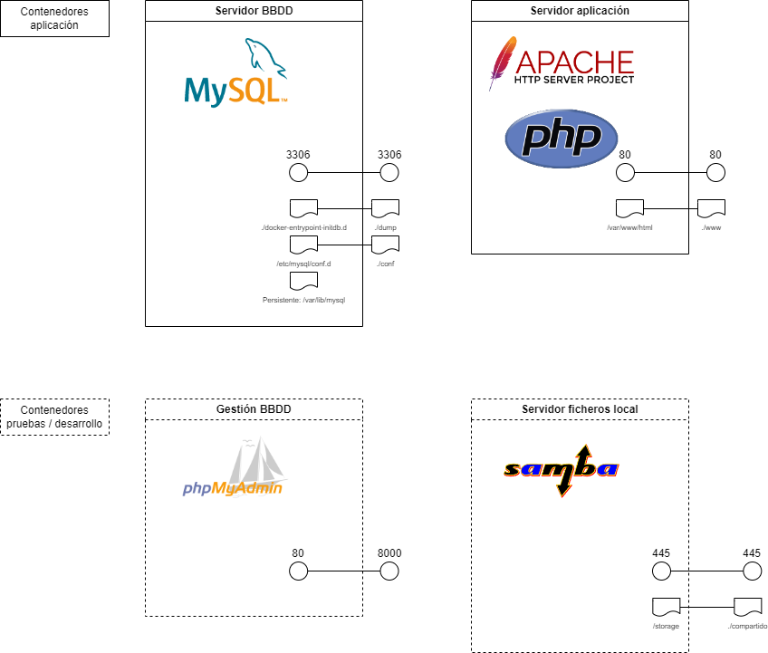

# REQUISITOS DEL SISTEMA
Este documento describe os requirimentos para *plataforma distribución documentos* especificando funcionalidades y modo de alcanzarlas.

## Descripción general

El proyecto es principalmente una aplicación web en PHP que otorga acceso externos a usuarios a documentos de distintos repositorios.

Se emplean 4 contenedores:
 - 2 contenedores para funcionamiento aplicación:
   - Aplicación: Con Apache + PHP
   - Base de datos: Con MySql
 - 2 contenedores de pruebas y desarrollo:
   - Servidor de ficheros mediante SMB
   - Servidor para gestión de base datos en desarrollo PHYMyAdmin

## Funcionalidades

Dependiendo del rol empleado, existen varias funcionalidades a implementar (ampliadas en [casos de uso]( <./3.1-Casos de uso.md>)):

### Como usuario:

- Consultar documentos.
- Visualizar documentos.
- Descargar documento.
- Editar información personal (nombre, contraseña).

### Como administrador general:

- Visualizar usuarios
- Gestionar administradores de repositorios
- Visión general del entorno

### Como administrador de un repositorio:

- Visualizar repositorios propios
- Añadir repositorios
- Editar repositorios
- Añadir usuarios
- Editar usuarios
- Asignar repositorios a usuarios (permisos)
- Visualizar usuarios

Describir que servizos ou operacións se van poder realizar por medio do noso proxecto, indicando que actores interveñen en cada caso.
Enumeralas, de maneira que na fase de deseño poidamos definir o diagrama ou configuración correspondente a cada funcionalidade.

Exemplo:
 1. Xestión de clientes na BD
 2. Xestión de pedidos
 ...
 3. Configuración do directorio activo
 4. Configuración do DNS
 
## Requisitos no funcionales

Un objetivo importante del proyecto es la **sencillez** y **claridad** a la hora de gestionar usuarios, permisos, etc.
Es importante un acceso seguro a la documentación por parte de usuarios y administradores.

## Tipos de usuarios
Existiran 3 tipos de usuarios:
- **Administrador general** de la solución, con visión general y posibilidad de configuración avanzada como conexión a base de datos, gestión usuarios administradores, etc.
- **Administrador de repositorios y usuarios**, con capacidad de gestión sobre usuarios y repositorios propios.
- **Usuario**: Sólo puede consultar y descargar documentación facilitada. No tienen capacidad de gestión.

## Evaluación de viabilidad técnica del proyecto

### Hardware requerido
Inicialmente cualquier hardware capaz de ejecutar un servidor web PHP (v8.3 en mi caso) y mysql  (v9.0.1 en mi caso) sería suficiente. Se eligieron esas versiones por ser las últimas disponibles en el momento de arrancar el proyecto.

### Software
A pesar de que existen varios frameworks que se podrían emplear para el desarrollo, se opta por emplear elementos nativos (PHP + HTML + CSS) como ejercicio de aprendizaje y simplicidad.
Para producción, un servidor web con capacidad de ejecutar PHP y MySql sería suficiente.
En desarrollo se empleará:
    Visual Studio Code
    MySql Workbench Community
    PhpMyAdmin
    Postman
    Software de virtualización (Docker y VirtualBox)
    Software ofimático (Microsof Office) y de esquemas/diagramas (Diagrams.net, GanntProject, Visual Paradigm Community).
    Otras aplicaciones para edición imágenes, vídeo, etc. (Openshot Video Studio, OBS Studio, Affinity Photo).
    Licencias de prueba CMS (Docuware).

## Interfaces externos
La relación con los repositorios externos (Docuware en este caso) se realiza mediante [API Rest facilitada](https://developer.docuware.com/rest/index.html).
Para la conexión desde aplicación php con base de datos se emplea PDO por permitir conexión a mayor número de bases de datos cara una posible ampliación futura.

### Interfaces de usuario
Existirán distintas pantalls/interfaces para interacción con usuarios:
- Pantalla de Login
- Pantalla de administrador general, con subpantallas correspondientes.
- Pantalla de administrador de repositorios y usuarios, con subpantallas correspondientes.
- Pantalla de usuario

### Interfaces hardware
No son necesarios interfaces hardware en este proyecto.

### Interfaces software
La solución se relacionará con soluciones de terceros (repositorios comerciales) a través del API facilitado (ej. [Docuware Rest API](https://developer.docuware.com/rest/index.html)).

## Análisis de riesgos e interesados
Dado que gran parte de los sistemas CMS comerciales están orientados a la venta de licencias, la solución puede impactar negativamente en las ventas de las licencias principales (un usuario al que le sea suficiente una licencias del presente proyecto no compraría una licencia de la solución completa). Por otra parte puede producirse el efecto contrario al incrementar las ventas de software comercial al disponer de una funcionalidad añadida a bajo coste.

## Actividades

Definir, de forma xeral, os pasos que se han seguir para levar a cabo o proxecto, de forma que na fase de planificación nos sirvan como referencia para detallar as tarefas, recursos e temporalización necesaria para cada fase.
Las principales actividades a desarrollar son:
1. Alta del entorno de desarrollo
2. Creación de diagramas (de las partes principales)
   1. [Diagrama de casos de uso (básico)]( <./3.1-Casos de uso.md>)
   2. [Modelo conceptual (básico)](<./3.2-Diagrama clases básico.md>)
   3. [Modelos de la base de datos](<./3.3-Modelo BBDD.md>)
   4. [Diagrama de despliegue y componentes](./img/Diagrama_despliegue_componentes.png "Diagrama de despliegue y componentes")
3. Desarrollo, incluyendo
   1. Pruebas unitarias y de integración de algunos elementos clave
   2. Documentación (básica)
4. Presentación

*Por motivos de tiempo se realizarán diagramas básicos de las partes principales.*

## Mejoras futuras
Inicialmente el proyecto será de sólo lectura e integrará con 2 tipos de repositorios (Docuware y sistema de carpetas local/SMB). Futuras ampliaciones permitirían dotar a usuarios de posibilidad de escritura de documentos o conectar la solución con otros repositorios (Sharepoint, por ejemplo).

