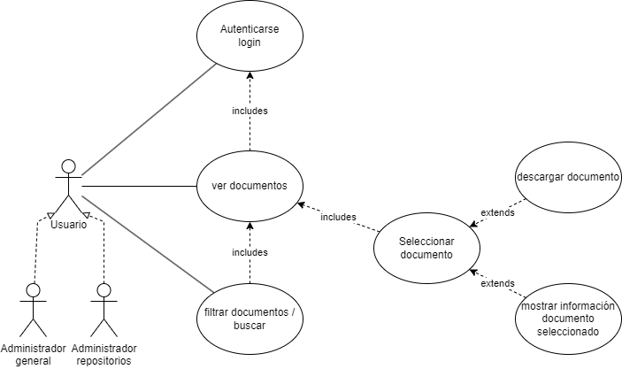
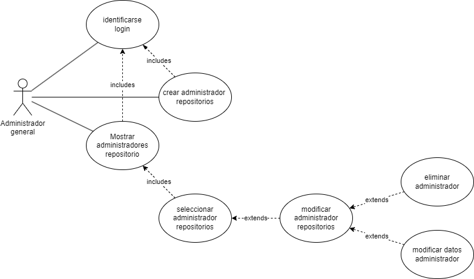
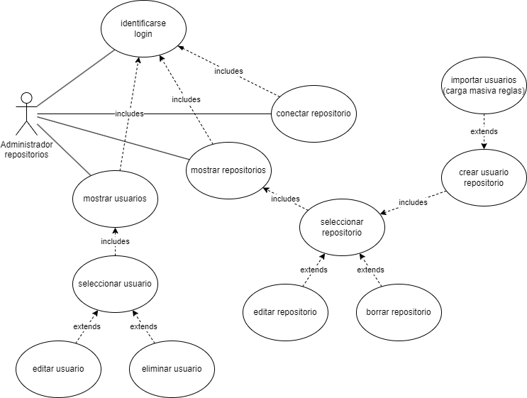

# CASOS DE USO
Este documento describe los principales casos de uso.

## Usuarios
Los principales casos de uso para los usuarios son los mostrados en el siguiente esquema:

## Administradores generales
Los administradores generales cuentan con los siguientes casos de uso:

## Administradores de repositorios
Los administradores de repositorios deben gestionar repositorios y usuarios asociados.
