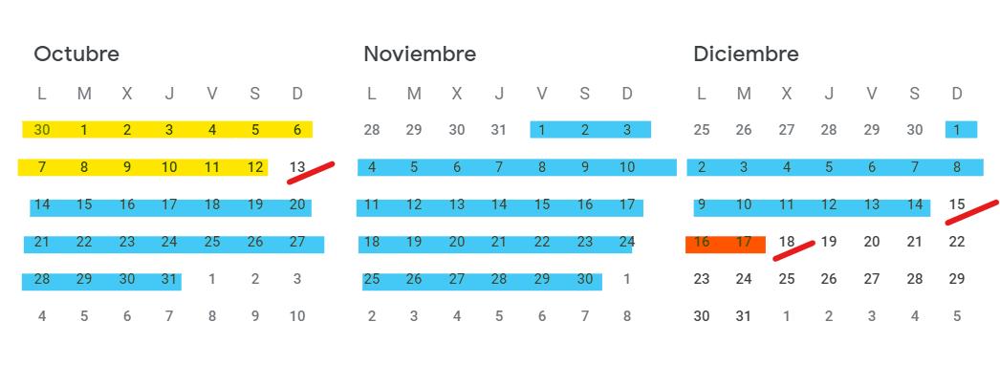
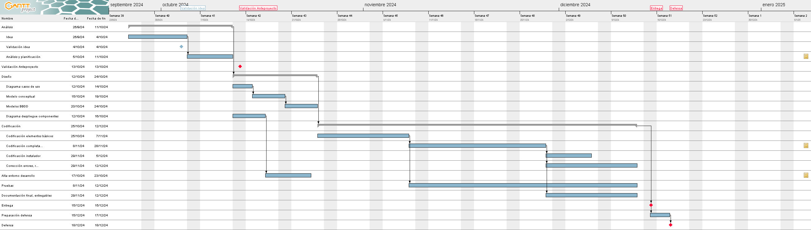

# PLANIFICACIÓN DEL PROYECTO

## Objetivos del proyecto

El proyecto es principalmente una aplicación web en PHP que otorga acceso externos a usuarios a documentos de distintos repositorios.
El principal objetivo del proyecto es el ejercicio como repaso en sí mismo, y  publicar una aplicación funcional en un breve espacio de tiempo tocando las principales facetas que pueda implicar el desarrollo de un proyecto de software de este tipo.

## Guía de planificación del proyecto

### Metodoloxía

Al tratarse de un proyecto relativamente pequeño, emplearemos una metodología de cascada con retroalimentación.

### Fases planificadas

Dividimos el proyecto en 3 grandes fases
- Análisis: donde damos forma a la idea y evaluamos requisitos, amenazas, planificación, recursos necesarios, etc.
- Diseño: donde definimos diversos aspectos del proyecto como funcionalidades, clases a emplear, etc.
- Implementación: donde codificamos, probamos y documentamos la aplicación en si, basándose principalmente en lo definido en las fases anteriores.

## Recursos y plazos

El proyecto se realizará dentro de los plazos asignados para el proyecto.

Los hitos principales son: 
- 13/Octubre: Anteproyecto validadado.
- 15/Diciembre: Entrega.
- 18/Diciembre: Defensa.

La planificación esperada del proyecto es conforme siguiente imagen (ver [Planificación.gan](./Planificación.gan)):

## Presupuesto

El principal coste del proyecto es el tiempo dedicado. Tomando como referencia el salario mínimo (bruto) publicado en el [BOE-A-2023-17238](https://www.boe.es/diario_boe/txt.php?id=BOE-A-2023-17238 "Resolución de 13 de julio de 2023, de la Dirección General de Trabajo, por la que se registra y publica el XVIII Convenio colectivo estatal de empresas de consultoría, tecnologías de la información y estudios de mercado y de la opinión pública.") un titulado de grado superior tiene, al menos, un salario bruto de 27.959,96 €/brutos año, lo que equicaldría a un salario diario de ~76,60 €/día (~9,57€/hora)
El desarrollo del proyecto será irregular por naturaleza pero, estimando una media de 2 horas diarias dedicadas durante toda la planificación del proyecto (83 días desde 26 de septiembre hasta 18 de diciembre) hacen un coste en tiempos de:

    83 días x 2 horas/día x 9,57 €/hora = 1.588,62 €.
    Redondeo a 1.600 € como ejercicio y estimación muy conservadora

Obviamente esta es una estimación muy conservadora, pero no es realista en absoluto.

No se consideran costes posteriores propios de representación, comercialización y soporte... Tampoco gastos de desplazamiento asociados a la defensa del proyecto.

El coste en equipamiento no se considera puesto que ya se dispone de equipo dedicado a desarrollo (coste aproximado 1.000 €) y espacios para "teletrabajo".

A mayores podrían existir costes de hosting (19,90€/año un hosting básico) y de dominio (18,99 € un dominio .es).

### Presupuesto por partidas de inversión / gasto:

| CONCEPTO | IMPORTE|
|--|--:|
|**A) INVERSIONS**
|Gastos de establecemento e gastos de constitución
|Total inmobilizacións inmateriais | 40 €|
|Terreos
|Construcións
|Instalacións técnicas
|Maquinaria
|Ferramentas 
|Mobiliario e instalacións
|Equipos informáticos| ~~1.000 €~~ |
|Elementos de transporte
|Outro inmobilizado material
|Total inmobilizacións materiais
|Outros gastos a distribuír en varios exercicios
|**TOTAL INVERSIÓNS:** | 40 € |
|**B) GASTOS**
|Compras de materiais
|Arrendamentos
|Publicidade, propaganda e relacións públicas
|Persoal | 1.600 € |
|Reparacións e conservación
|Servizos de profesionais independentes
|Outros gastos xerais
|Gastos financeiros
|Amortizacións
|Gastos de xestión e administración
|**TOTAL GASTOS:** | 1.600 € |

|TOTAL PRESUPUESTO: **1.640 €**|
|--:|

### WEBGRAFÍA

- [BOE-A-2023-17238 - XVIII Convenio colectivo estatal de empresas de consultoría, tecnologías de la información y estudios de mercado y de la opinión pública](https://www.boe.es/diario_boe/txt.php?id=BOE-A-2023-17238 "Resolución de 13 de julio de 2023, de la Dirección General de Trabajo, por la que se registra y publica el XVIII Convenio colectivo estatal de empresas de consultoría, tecnologías de la información y estudios de mercado y de la opinión pública.")
- [Tarifas hosting Axarnet](https://axarnet.es/hosting "tarifas hosting")
- [Tarifas dominios Axarnet](https://axarnet.es/dominios "tarifas dominios")

